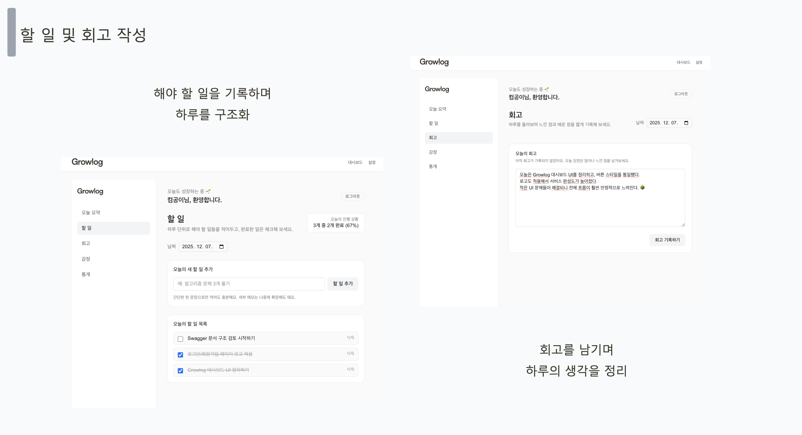
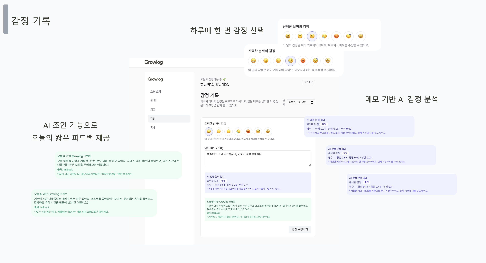
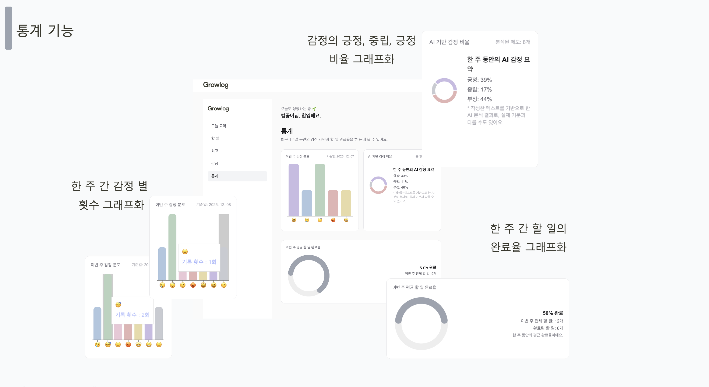
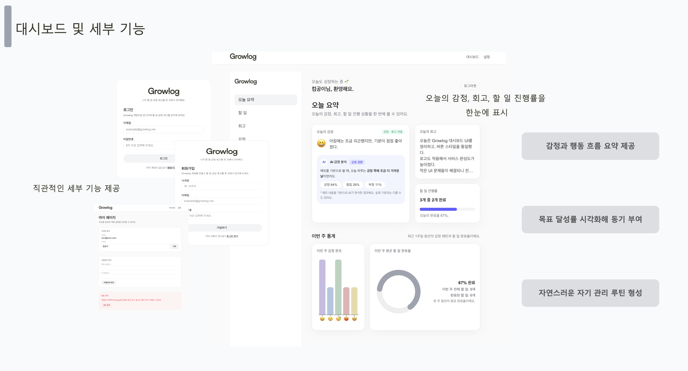
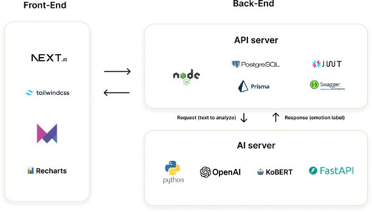

# 🌱 Growlog Frontend

하루의 **할 일, 감정, 회고**를 기록하고  
AI 분석을 통해 **자기 관리 패턴을 시각화하는 서비스**

> 오늘의 기록을 통해 스스로의 성장 흐름을 확인하는 감정 기반 자기관리 플랫폼

---

## 📌 Overview

Growlog는 하루의 행동과 감정을 기록하고  
AI 분석을 통해 **감정 흐름과 목표 달성률을 시각적으로 확인할 수 있는 서비스**입니다.

단순한 할 일 관리가 아니라  
**행동 → 감정 → 회고 → 통계**의 흐름을 통해  
사용자가 자신의 하루를 돌아보고 자기 관리 루틴을 형성하도록 돕습니다.

---

## 🧩 주요 기능

### 1️⃣ 할 일 관리 & 회고 기록

- 하루의 할 일을 기록하고 진행 상태 관리
- 완료된 작업 체크 기능
- 하루 회고 작성 기능
- 하루를 구조화하여 생산성 향상

---

### 2️⃣ 감정 기록

- 하루 한 번 감정 선택
- 간단한 메모 작성
- 감정 기록 기반 데이터 축적

---

### 3️⃣ AI 기반 감정 분석

- 메모 텍스트 기반 감정 분석
- 긍정 / 중립 / 부정 비율 계산
- AI 코멘트 기반 간단한 피드백 제공

---

### 4️⃣ 통계 및 데이터 시각화

- 한 주 감정 분포 그래프
- 할 일 완료율 시각화
- 감정 변화 흐름 확인
- 자기 관리 패턴 파악 가능

---

### 5️⃣ 대시보드

- 오늘의 감정
- 오늘의 회고
- 할 일 진행률
- 주간 통계

하루의 주요 데이터를 **한 화면에서 확인 가능**

---

## 🏗 Architecture

### Frontend

- Next.js
- TailwindCSS
- Zustand
- Chart.js

### Backend

- Node.js
- Prisma
- PostgreSQL
- Swagger

### AI

- Python
- FastAPI
- Sentiment Analysis

---

## 📂 Project Structure

Growlog_frontend
│
├── app
│ ├── dashboard
│ ├── todo
│ ├── emotion
│ └── statistics
│
├── components
│
├── hooks
│
├── services
│
├── store
│
└── utils

---

## 🎯 Purpose

- 감정 기반 자기 관리 서비스 구현
- 사용자 행동 데이터를 통한 자기 인식 강화
- 감정 흐름과 행동 패턴을 연결

---

## 🚀 Future Improvements

- AI 감정 분석 고도화
- 장기 감정 패턴 분석
- 목표 관리 기능
- 알림 및 루틴 기능
